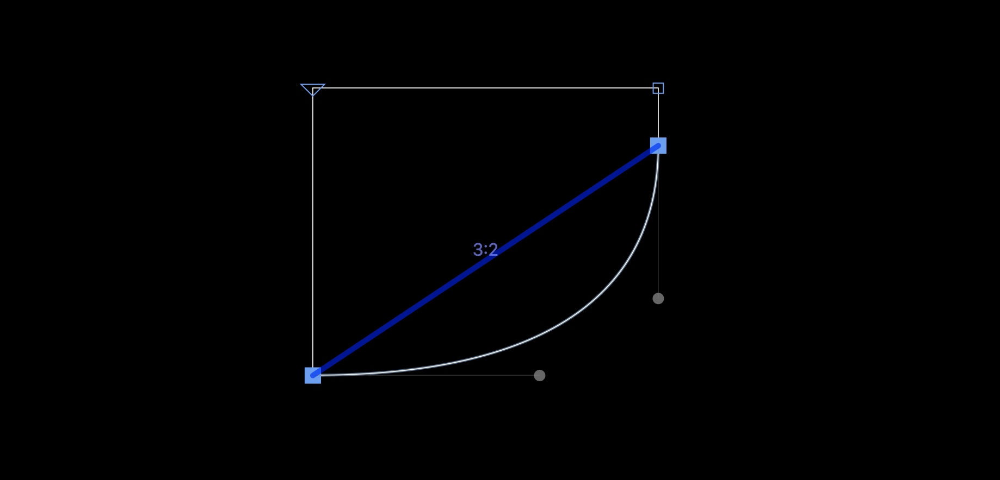

# RatioReporter

[Glyphs.app font editor](https://glyphsapp.com/) plugin for displaying the vertical-to-horizontal ratio between selected points. After installation, it will add the menu item *View > Show Ratios*. You can set a keyboard shortcut in System Preferences.

### Installation

1. One-click install *Ratio Reporter* from *Window > Plugin Manager*
2. Restart Glyphs.

### Usage Instructions

1. Select at least two nodes in Edit View.
2. Use *View > Show Ratios* to toggle the display of the vertical-to-horizontal ratio between the first and last selected points.

### Requirements

The plugin needs Glyphs 3 or higher, running on OS X 10.11 or later.

### License

Copyright 2022 Richard McDonald (@richardmcdonald48), with thanks to Rainer Scheichelbauer (@mekkablue).
Based on sample code by Georg Seifert (@schriftgestalt).

Licensed under the Apache License, Version 2.0 (the "License");
you may not use this file except in compliance with the License.
You may obtain a copy of the License at

http://www.apache.org/licenses/LICENSE-2.0

See the License file included in this repository for further details.
